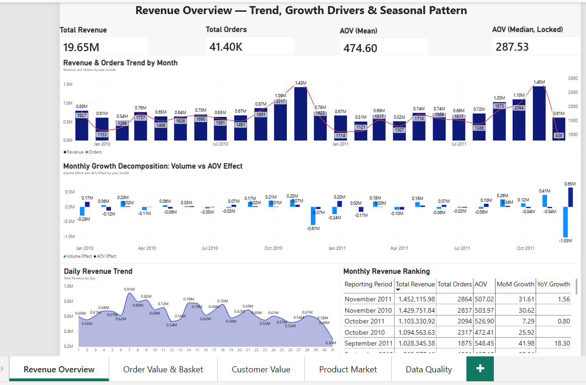
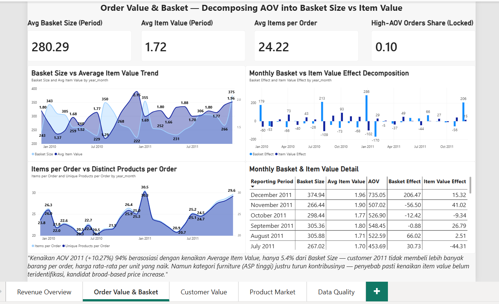
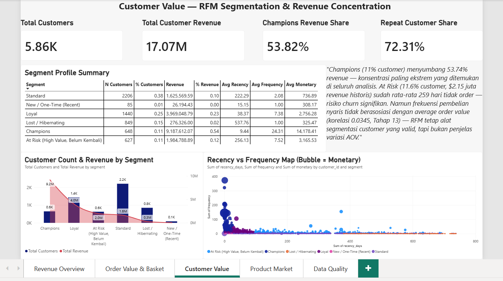
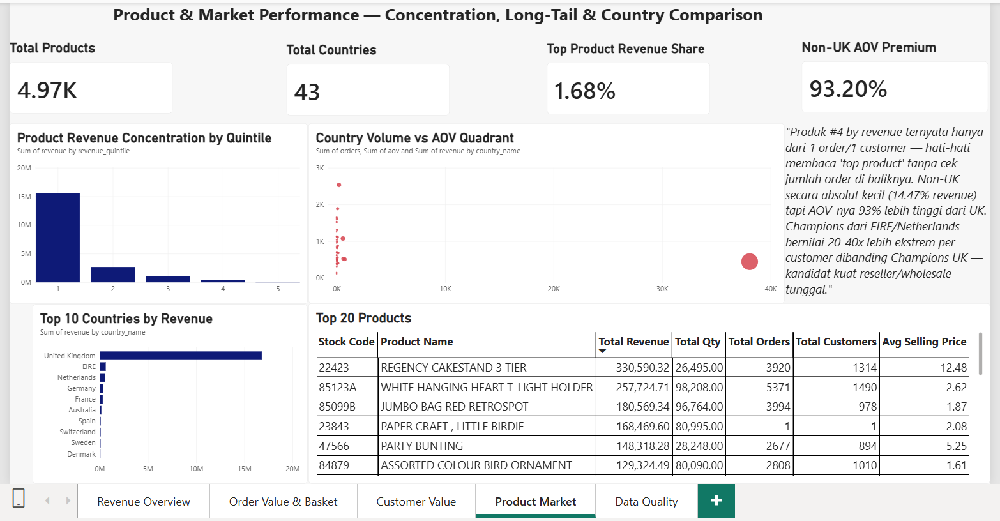
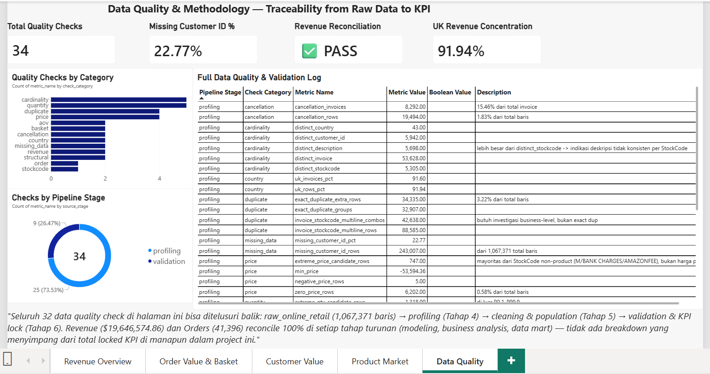

# Online Retail Analytics

End-to-end analytics project pada dataset **UCI Online Retail II** (2009-2011):
profiling → cleaning → validation → EDA → dimensional modeling → business
analysis → data mart → dashboard (Power BI), lengkap dengan governance
(reconciliation, causal-boundary, dan revision log) di setiap tahap.

> README ini bisa dipahami tanpa membuka Power BI — semua temuan kunci
> dirangkum di bawah, dengan link ke dokumentasi lengkap dan screenshot
> dashboard.

---

## 1. Ringkasan Project

| | |
|---|---|
| **Dataset** | [UCI Online Retail II](https://archive.ics.uci.edu/dataset/502/online+retail+ii) — 1,067,371 baris transaksi, Des 2009–Des 2011 |
| **Tools** | DuckDB (SQL pipeline), Power BI (dashboard) |
| **Total Revenue (locked)** | $19,646,574.86 |
| **Total Orders (locked)** | 41,396 |
| **AOV Mean / Median** | $474.60 / $287.53 |

Seluruh angka di atas **reconcile 100%** dari raw CSV sampai dashboard —
tidak ada breakdown di tahap manapun yang menyimpang dari total ini (lihat
`docs/methodology.md` untuk detail validasi).

---

## 2. Struktur Repository

```
online-retail-analytics/
├── data/
│   ├── raw/              # CSV asli, TIDAK PERNAH diubah
│   ├── processed/        # Staging output tiap tahap (parquet, di-gitignore)
│   └── data_mart/        # 7 data mart final untuk BI layer (di-gitignore)
├── sql/                  # 15 file SQL, urut sesuai tahap pipeline (lihat §4)
├── docs/                 # Dokumentasi & findings tiap tahap (lihat §5)
├── dashboard/            # File Power BI (.pbix)
├── screenshots/          # Screenshot 5 halaman dashboard
└── db/                   # retail.duckdb (working database, di-gitignore)
```

---

## 3. Temuan Kunci (Highlights)

Ringkasan lengkap dengan evidence & recommendation ada di
`docs/business_recommendations.md`. Beberapa temuan paling penting:

- **Konsentrasi customer ekstrem**: 10.98% customer (segmen "Champions")
  menyumbang **53.74%** dari total Customer Revenue.
- **Growth 2011 bersifat value-driven**: Revenue naik tipis (+1.02%), tapi
  Orders turun 8.38% sementara AOV naik 10.27% — 94% dari kenaikan AOV itu
  berasosiasi dengan Average Item Value, bukan Basket Size.
- **10% order = 47.83% revenue**: order di atas P90 AOV rata-rata berisi
  78 produk berbeda, jauh di atas order normal (18 produk).
- **Non-UK 93% lebih tinggi AOV-nya** dari UK, meski kontribusi revenue
  absolutnya cuma 14.47% — mengindikasikan karakter wholesale/reseller.
- **Segment/Country/Month cuma menjelaskan <1%** variasi order-level
  revenue (eta-squared) — driver AOV sesungguhnya kemungkinan bersifat
  individual/order-specific, bukan kategorikal.

Semua temuan bersifat **observasional** (asosiasi pada data historis),
bukan klaim sebab-akibat — lihat Causal Interpretation Boundaries di
`docs/aov_drivers_findings.md`.

---

## 4. Dashboard

File: `dashboard/retail_analytics.pbix` — 5 halaman:

| Halaman | Fokus |
|---|---|
| 1. Revenue Overview | Trend, growth decomposition (volume vs AOV effect), pola musiman |
| 2. Order Value & Basket | Dekomposisi AOV (basket size vs average item value) |
| 3. Customer Value | RFM segmentation, revenue concentration |
| 4. Product & Market | Product concentration, country volume vs AOV |
| 5. Data Quality & Methodology | Traceability, 34 data quality check |

Screenshot tiap halaman ada di `screenshots/`:







---

## 5. Dokumentasi

| Dokumen | Isi |
|---|---|
| `docs/methodology.md` | Definisi KPI locked, reconciliation, revision log |
| `docs/assumptions_and_limitations.md` | Keputusan treatment data & justifikasi |
| `docs/data_dictionary.md` | Definisi kolom semua tabel (raw → data mart) |
| `docs/profiling_findings.md` | Temuan anomaly data mentah |
| `docs/business_recommendations.md` | 8 insight lengkap Finding → Evidence → Impact → Recommendation |
| `docs/eda_findings.md` | Eksplorasi 8 kategori (Revenue, Order, AOV, Customer, Product, Country, Time, Outlier) |
| `docs/revenue_order_decomposition_findings.md` | Volume vs value-driven growth |
| `docs/order_value_findings.md` | Basket size vs item value decomposition |
| `docs/customer_segmentation_findings.md` | RFM & segment profile |
| `docs/product_country_performance_findings.md` | Product & country performance |
| `docs/aov_drivers_findings.md` | Correlation & contribution analysis (eta-squared) |

---

## 6. Cara Reproduce dari Raw Data

Repository ini bisa dijalankan ulang penuh dari raw CSV. Prasyarat: DuckDB CLI.

```powershell
# 1. Masuk ke root project
cd online-retail-analytics

# 2. Buka DuckDB (buat/gunakan retail.duckdb)
./duckdb.exe retail.duckdb

# 3. Jalankan seluruh SQL berurutan sesuai nomor file
.read sql/02_data_collection.sql
.read sql/03_profiling.sql
.read sql/04_analytical_population.sql
.read sql/05_kpi_definition.sql
.read sql/06_eda.sql
.read sql/07_modeling.sql
.read sql/08_revenue_order_decomposition.sql
.read sql/09_order_value.sql
.read sql/10_customer_segmentation.sql
.read sql/11_product_country_performance.sql
.read sql/12_aov_drivers.sql
.read sql/13_data_marts.sql
.read sql/14_parquet_export.sql
```

Setiap file punya reconciliation check bawaan — cek output tiap `.read`
untuk memastikan `pass = true` di setiap tahap sebelum lanjut ke file
berikutnya. Kalau ada `pass = false`, JANGAN lanjut — itu tanda ada
masalah data yang perlu diperbaiki dulu (lihat catatan rounding di
`docs/data_dictionary.md` §3 kalau selisihnya cuma beberapa sen).

Setelah semua file dijalankan, 7 file parquet di `data/data_mart/` siap
di-import ke Power BI (atau BI tool lain).

---

## 7. Data Source & Attribution

Dataset: Chen, Daqing. (2019). *Online Retail II*. UCI Machine Learning
Repository. https://doi.org/10.24432/C5CG6D

## 8. Known Limitations

Ringkasan (detail lengkap di `docs/assumptions_and_limitations.md`):

- 22.77% baris tidak punya Customer ID — Customer Population lebih kecil
  (72.78%) dari Revenue Population.
- UK mendominasi 91.94% baris — analisis country selalu perlu disandingkan
  absolute vs relative performance.
- Semua hubungan yang ditemukan bersifat asosiasi, bukan kausal.
- Whitelist non-product StockCode berbasis sample manual, bukan audit
  penuh 5,305 distinct StockCode.

---

## Status

✅ Part 1-7 selesai (Project Setup → Communication & Delivery)
✅ Repository dapat dijalankan ulang penuh dari raw data
✅ Semua KPI dashboard tervalidasi & traceable ke SQL